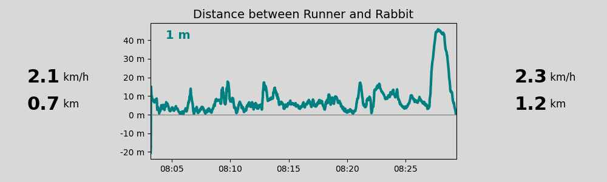

# Challenge-6-Make-Run-Fun-Again
The gpx folder contains 3 gpx files drawn using the https://schweizmobil.ch website. The Murtenlauf 17.17km route can be found in the "murtenlauf1717.gpx".

The runs data contains sensor data from 4 runners who completed the various tracks.

## Cleaning and Preprocessing of the Input Data
The Python files `change_date.py` and `cleaner.py` were used to prepare the data input files. You do not have to do that again. The files to be used for the simulator are the `*cleaned.csv` files.

### change_date.py
This file modifies the epoch time of the data file `dump_300857_2024_10_06T07_45_00_000000Z.csv.ori` to be closer to the other runners.

300857 -> epoch 1728202247 -> Sunday, October 6, 2024 10:10:48 AM GMT+02:00 DST --> 1728201795 (Sunday, October 6, 2024 10:03:15 AM GMT+02:00)

Calculate the time difference to correct:

1728202247 - 1728201795 = 452

301612 -> epoch 1728201784 -> Sunday, October 6, 2024 10:03:04 AM GMT+02:00 DST

301725 -> epoch 1728201790 -> Sunday, October 6, 2024 10:03:10 AM GMT+02:00 DST

301977 -> epoch 1728201780 -> Sunday, October 6, 2024 10:03:00 AM GMT+02:00 DST

### cleaner.py
This application sets the altitude to all elements in the CSV file. The sensor always provides a set of 10 measurements, and only the last measurement contains the altitude.

### Challenge Code and Material
This folder includes everything that was used as the final solution for the challenge pitch. It contains code, as well as the saved PNG files from which the animated GIF for the presentation was created.

Since we only had data for four runners and limited time, some parts, e.g., the rabbit assignment, are currently hardcoded and only for one example - but this can be adjusted with some additional code.

Following are some remarks on the Python files:

**runners_3k.py**
Reads data from the initial topic (i.e., topic with the stream data) and calculates the time each runner needs to run the first 3km. Currently, the results are not further processed.

*Implementation* - Step to assign rabbits to runners after 3km needs to be implemented.

**distance_runner_rabbit.py**
Runner and rabbit IDs are hardcoded. Reads from the stream topic, calculates the distance between runner and rabbit each second. This means the data is downsampled from the original 10 Hz sampling frequency.

Remarks regarding the distance: Tests were made to calculate the distance between runner and rabbit based on the position on the track, rather than calculating the distance between them based on their coordinates. However, the current code to do this is not feasible for real-time implementation as it was way too slow and also inaccurate as shown below.

Therefore, the distance between runner and rabbit was calculated based on their coordinates. In addition, the cumulative distance ran by each is used to define if the runner overtakes the rabbit (i.e., the distance would then be negative).

Besides the distance between runner and rabbit, also their coordinates, current speed, and cumulative distance are stored. This is written to a new topic (*Challenge6RunnerDistanceComparisonAdd*).

**live_visualization:distance.py**
Reads the data from the new topic *Challenge6RunnerDistanceComparisonAdd* and uses the data for a live visualize of the information. For the purpose of the Hackdays' pitch png files are saved and in combination with the *create_movie.py* script the following gif was created.

[Contact concerning code](mailto:nathalie.alexander@gmx.at)
